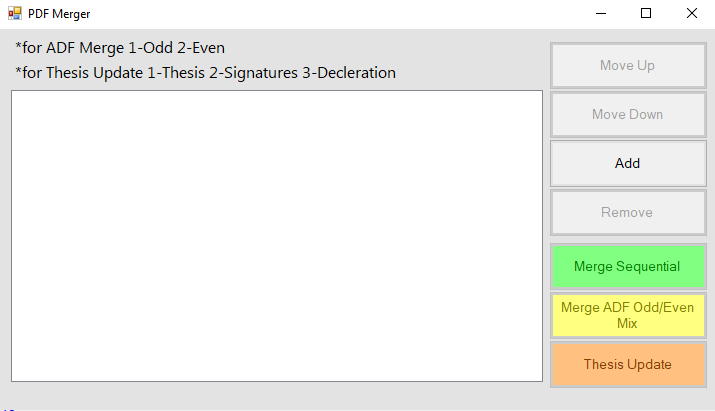
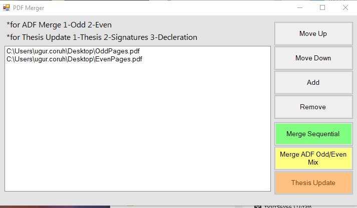
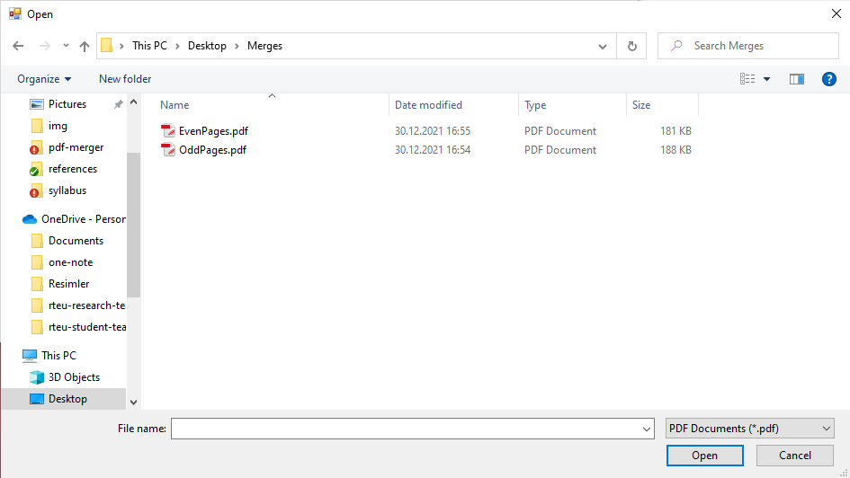

# PDF Merger Tool for Single Side ADF Scanner

## Usage

### Merging ADF Scanned Odd/Even Pages

### Adding PDF Files

#### Method-1

Drag-drop pdf files to the white area (list box)

- The first file should include odd pages

- The second file, should include even pages

#### Method-2

Use Add Button and Select Files, You can select multiple files.

Select "Merge ADF Odd/Even Mix"" to combine PDFs.

If you need sequential merge you can use "Merge Sequential" 

Also, there is a Thesis Update feature to replace signed original papers with your pdf output of the thesis.

## Development

Install Visual Studio 2022

[Visual Studio 2022 Community Edition – Son Ücretsiz Sürümü İndir](https://visualstudio.microsoft.com/tr/vs/community/)

Install Wix Toolkit and Visual Studio 2022 Extension

[Downloads](https://wixtoolset.org/releases/)

After installation, if you have a reference problem you need to configure DLL's from the path such as "WixUIExtension.dll"

C:\Program Files (x86)\WiX Toolset v3.11\bin
