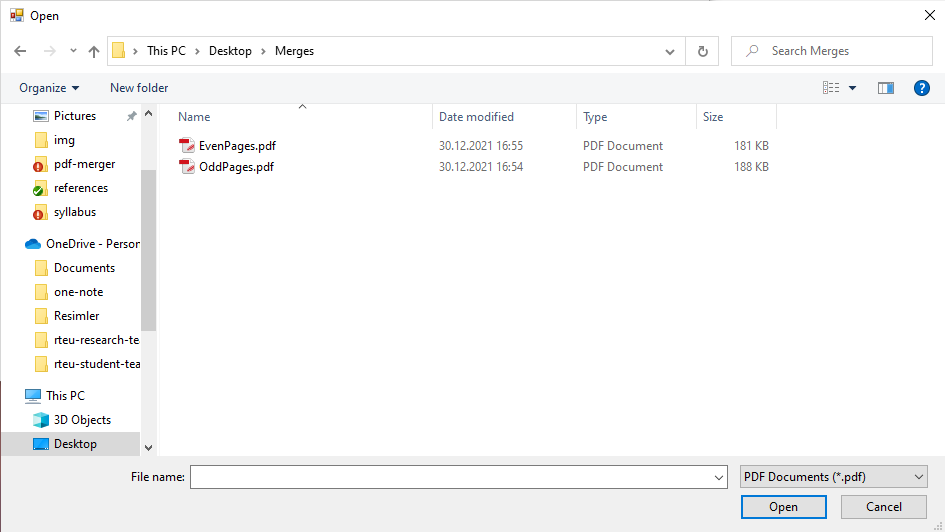

# PDF Merger


[](https://github.com/ucoruh/pdf-merger/actions/workflows/build-and-test.yml)
[](https://github.com/ucoruh/pdf-merger/releases/latest)
[](https://ucoruh.github.io/pdf-merger/)

A Windows desktop application for merging, splitting, extracting, and rotating PDF files with specialized support for **single-side ADF (Automatic Document Feeder) scanners**. Built with C# WinForms on .NET 8 and [PDFsharp](http://www.pdfsharp.net/).

> **[View Full Documentation](https://ucoruh.github.io/pdf-merger/)** | **[Download Latest Release](https://github.com/ucoruh/pdf-merger/releases/latest)**

## Features

### Sequential Merge

Combine multiple PDF files into a single document. Pages are appended sequentially in the order you specify.

### ADF Odd/Even Page Merge

Designed for scanners that only scan one side at a time. Provide two PDFs (odd pages and even pages), and the tool interleaves them into a properly ordered double-sided document.

### Thesis Update

Insert signed signature and declaration pages into your thesis PDF at the correct positions (pages 3 and 4).

### Split PDF

Split a PDF into multiple files at specified page boundaries. For example, a 10-page PDF split at pages 3 and 7 produces three separate files.

### Extract Pages

Extract specific pages from a PDF using flexible range syntax (e.g., `1-3,5,8-10`) into a new document.

### Rotate Pages

Rotate all pages in a PDF by 90, 180, or 270 degrees. Useful for fixing scanned documents with wrong orientation.

## Screenshots

| Main Window | Adding Files |
|-------------|--------------|
|  |  |

## Installation

### Download a Release

Download the latest release from the [Releases](https://github.com/ucoruh/pdf-merger/releases) page.

### Build from Source

1. Install the [.NET 8.0 SDK](https://dotnet.microsoft.com/download/dotnet/8.0) (or Visual Studio 2022 with the **.NET desktop development** workload)
2. Clone the repository:

   ```bash
   git clone https://github.com/ucoruh/pdf-merger.git
   ```

3. Build and run:

   ```bash
   dotnet build PdfMerger.sln
   dotnet run --project src/PdfMerger/PdfMerger.csproj
   ```

## Usage

### Adding PDF Files

- **Drag and drop** PDF files into the white list area
- **Or** click the **Add** button to browse and select files (multi-select supported)

### Merge Sequentially

1. Add 2 or more PDF files
2. Reorder files using **Move Up** / **Move Down** buttons
3. Click **Merge Sequential**
4. Choose the output file location

### Merge ADF Odd/Even

1. Add exactly 2 PDF files:
   - First file: odd-numbered pages
   - Second file: even-numbered pages
2. Click **Merge ADF Odd/Even Mix**
3. Choose the output file location

### Update Thesis

1. Add exactly 3 PDF files in this order:
   - Thesis document
   - Signatures page
   - Declaration page
2. Click **Thesis Update**
3. Choose the output file location

### Split a PDF

1. Add the PDF file you want to split
2. Click **Split PDF**
3. Enter page numbers to split after (e.g., `3,7,12`)
4. Choose the output folder

### Extract Specific Pages

1. Add the PDF file you want to extract from
2. Click **Extract Pages**
3. Enter the page range (e.g., `1-3,5,8-10`)
4. Choose the output file location

### Rotate a PDF

1. Add the PDF file you want to rotate
2. Click **Rotate Pages**
3. Select the rotation angle (90°, 180°, or 270°)
4. Choose the output file location

## Development

### Prerequisites

- [.NET 8.0 SDK](https://dotnet.microsoft.com/download/dotnet/8.0) (or Visual Studio 2022 with .NET desktop workload)
- (Optional) [Inno Setup 6](https://jrsoftware.org/isinfo.php) for building the installer

### Project Structure

```text
pdf-merger/
  src/
    PdfMerger/              # Main WinForms application (.NET 8)
      Services/             # PDF merge business logic
      MainForm.cs           # UI code
      Program.cs            # Entry point
  tests/
    PdfMerger.Tests/        # NUnit unit tests
  installer/                # Inno Setup installer script
  docs/                     # MkDocs documentation source
  doxygen/                  # Doxygen configuration
  .github/workflows/        # CI/CD pipelines
```

### Build Commands

```bash
dotnet restore PdfMerger.sln
dotnet build PdfMerger.sln --configuration Release
```

### Run Tests

```bash
dotnet test PdfMerger.sln --configuration Release
```

## Documentation

- [Online Documentation](https://ucoruh.github.io/pdf-merger/) (MkDocs)
- [API Reference](https://ucoruh.github.io/pdf-merger/api-reference/)

## Contributing

Contributions are welcome! Please read the [Contributing Guide](CONTRIBUTING.md) for details.

## Author

**Ugur CORUH** - [GitHub](https://github.com/ucoruh)
