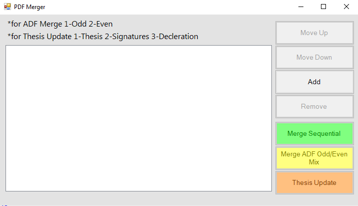

# Getting Started

## System Requirements

- Windows 10 or later
- .NET Framework 4.8 runtime (included in Windows 10 May 2019 Update and later)

## Installation

### Option 1: Download Release

1. Go to the [Releases](https://github.com/ucoruh/pdf-merger/releases) page
2. Download the latest `PdfMerger-vX.X.X.zip` archive
3. Extract the archive to a folder of your choice
4. Run `PdfMerger.exe`

### Option 2: Build from Source

1. Install [Visual Studio 2022](https://visualstudio.microsoft.com/vs/community/) with the **.NET desktop development** workload
2. Clone the repository:

    ```bash
    git clone https://github.com/ucoruh/pdf-merger.git
    cd pdf-merger
    ```

3. Open `PdfMerger.sln` in Visual Studio
4. Press `F5` to build and run

## First Use

1. Launch the application
2. Add PDF files using drag-and-drop or the **Add** button
3. Select the appropriate merge mode:
    - **Merge Sequential** for combining multiple PDFs
    - **Merge ADF Odd/Even Mix** for interleaving scanner pages
    - **Thesis Update** for inserting signed pages into a thesis
4. Choose the output file location and the merged PDF will open automatically


