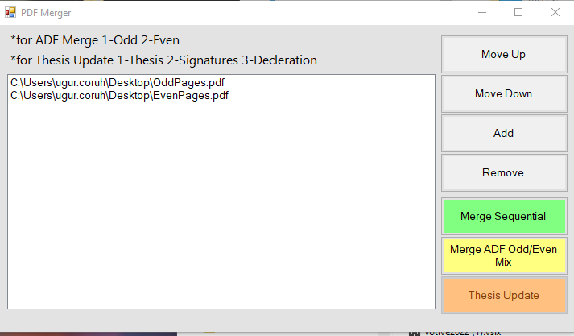

# User Guide

## Adding Files

### Drag and Drop

Drag PDF files from Windows Explorer directly into the white list area of the application.

!!! note
    Only `.pdf` files are accepted. Non-PDF files will be rejected with an error message.

### Add Button

Click the **Add** button to open a file browser dialog. You can select multiple files at once.

## Managing the File List

- **Move Up** - Move the selected file up in the list order
- **Move Down** - Move the selected file down in the list order
- **Remove** - Remove the selected file from the list

## Merge Modes

### Sequential Merge

Combines all listed PDF files into a single document in the displayed order.

**Requirements:** At least 2 PDF files

**How it works:**

1. Add 2 or more PDF files
2. Arrange them in the desired order
3. Click **Merge Sequential**
4. Choose the save location

The output file will contain all pages from all input files, appended sequentially.

### ADF Odd/Even Merge

Designed for single-side ADF scanners. When you scan a double-sided document with a single-side scanner:

1. First, scan all pages face-up (odd pages: 1, 3, 5, 7...)
2. Flip the stack and scan again (even pages in reverse: 8, 6, 4, 2...)

This mode interleaves the pages to reconstruct the correct page order.

**Requirements:** Exactly 2 PDF files with equal page counts

**How it works:**

1. Add the odd-pages PDF as the first file
2. Add the even-pages PDF as the second file
3. Click **Merge ADF Odd/Even Mix**
4. Choose the save location

### Thesis Update

Inserts signed signature and declaration pages into your thesis PDF at specific positions (replacing pages 3 and 4).

**Requirements:** Exactly 3 PDF files

**How it works:**

1. Add files in this exact order:
    - **File 1:** Main thesis document
    - **File 2:** Signed signatures page
    - **File 3:** Signed declaration page
2. Click **Thesis Update**
3. Choose the save location

The output will be your thesis with the signature page at position 3 and the declaration page at position 4.

## PDF Tools

### Split PDF

Split a single PDF into multiple files at specified page boundaries.

**Requirements:** At least 1 PDF file in the list

**How it works:**

1. Add the PDF file you want to split
2. Click **Split PDF**
3. Enter the page numbers to split after (comma-separated, e.g., `3,7,12`)
4. Choose the output folder
5. The split files will be saved as `split_part1.pdf`, `split_part2.pdf`, etc.

!!! example
    A 10-page PDF split at pages 3 and 7 produces:

    - `split_part1.pdf` — pages 1-3
    - `split_part2.pdf` — pages 4-7
    - `split_part3.pdf` — pages 8-10

### Extract Pages

Extract specific pages from a PDF into a new document.

**Requirements:** At least 1 PDF file in the list

**How it works:**

1. Add the PDF file you want to extract from
2. Click **Extract Pages**
3. Enter the page range to extract (e.g., `1-3,5,8-10`)
4. Choose the output file location

!!! tip
    The page range syntax supports:

    - Single pages: `5`
    - Ranges: `1-3`
    - Mixed: `1-3,5,8-10`

### Rotate Pages

Rotate all pages in a PDF by a specified angle.

**Requirements:** At least 1 PDF file in the list

**How it works:**

1. Add the PDF file you want to rotate
2. Click **Rotate Pages**
3. Select the rotation angle (90°, 180°, or 270°)
4. Choose the output file location
